# **Intelligent Financial Planning Hub (Finance Tracker)**

 <!-- Add your banner image -->

## 🌟 **Overview**
The **Intelligent Financial Planning Hub** is a feature-rich web application designed to help users manage their personal finances. Track expenses, set budgets, and generate insightful reports, all within a user-friendly and interactive interface.

### Key Features:
- 🧾 **Expense Management**: Add, edit, and track expenses seamlessly.
- 📊 **Data Visualizations**: Interactive charts for spending analysis.
- 🚨 **Budget Alerts**: Stay on track with real-time notifications.
- 📥 **Report Generation**: Export financial reports as PDFs.
- ⚙️ **User Authentication**: Secure login and registration.

---

## 💻 **Technologies Used**
| **Technology** | **Usage**                  |
|-----------------|---------------------------|
| HTML/CSS        | Frontend Structure        |
| JavaScript      | Interactive Features      |
| Django (Python) | Backend Framework         |
| MySQL           | Database Management       |
| jsPDF           | PDF Generation           |
| jsCharts           | Visual Graphs and charts|

---

## 🛠️ **Setup and Installation**

### Prerequisites
1. Python 3.x installed on your machine.
2. MySQL server running locally or remotely.
3. Required Python libraries (listed below).

### Steps to Run the Project
1. Clone the repository:
   ```bash
   git clone https://github.com/pvshyamlal/Intelligent-Financial-Planning-Project
   cd financial_planner
   ```
2. Create and activate a virtual environment:
   ```bash
   python -m venv env
   source env/bin/activate  # On Windows: .\env\Scripts\activate
   ```
3. Install dependencies:
   ```bash
   pip install -r requirements.txt
   ```
4. Configure the database:
   - Create a database (e.g., `finance_tracker`).
   - Update the credentials in `settings.py` under the `DATABASES` section.

5. Apply database migrations:
   ```bash
   python manage.py makemigrations
   python manage.py migrate
   ```
6. Start the development server:
   ```bash
   python manage.py runserver
   ```
7. Access the application:
   Open your browser and navigate to [http://127.0.0.1:8000](http://127.0.0.1:8000).

---

## 📋 **Features**

### 1. **User Authentication**
   - Secure Registration & Login
   - Personalized Dashboard

### 2. **Expense Management**
   - Add, view, edit, and delete expenses.
   - Categorize expenses by type and date.

### 3. **Financial Reports**
   - Generate reports for specific date ranges.
   - Visual insights: pie charts, line graphs.
   - Export reports as PDFs.

### 4. **Dashboard Visualization**
   - Real-time updates with spending summaries.
   - Bar charts and speedometer visualizations.

### 5. **Budget Planning**
   - Set spending limits for categories (e.g., Food, Utilities).
   - Receive alerts for overspending.

---
Here’s the updated **Screenshots** section with the required Markdown line for each entry:

---

### 📸 **Screenshots For Key Functionalities**
1. **Home Page**  
   

2. **Registration Page**  
   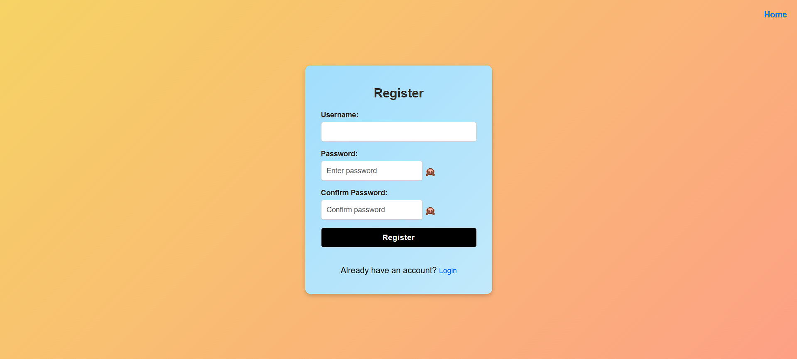

3. **Login Page**  
   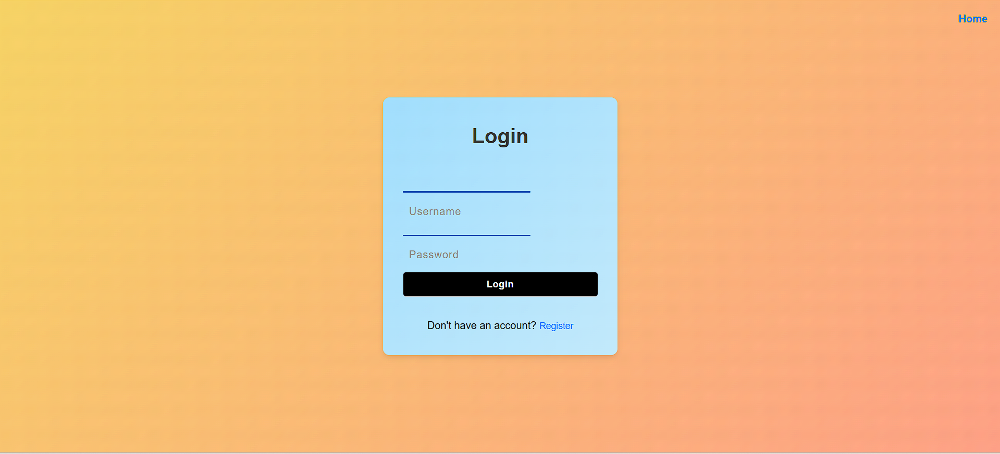

4. **Dashboard**  
   

5. **Add Expense Form**  
   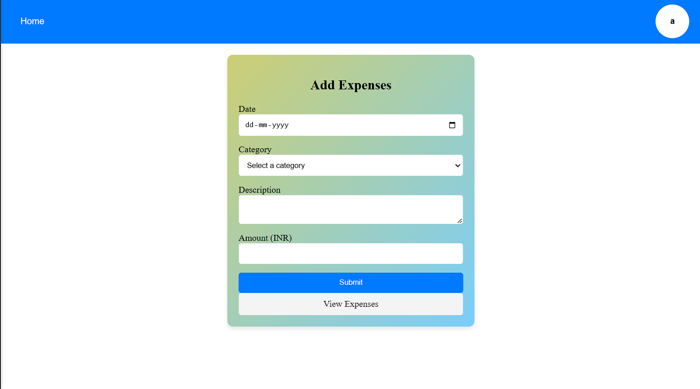

6. **View Expenses Page**  
   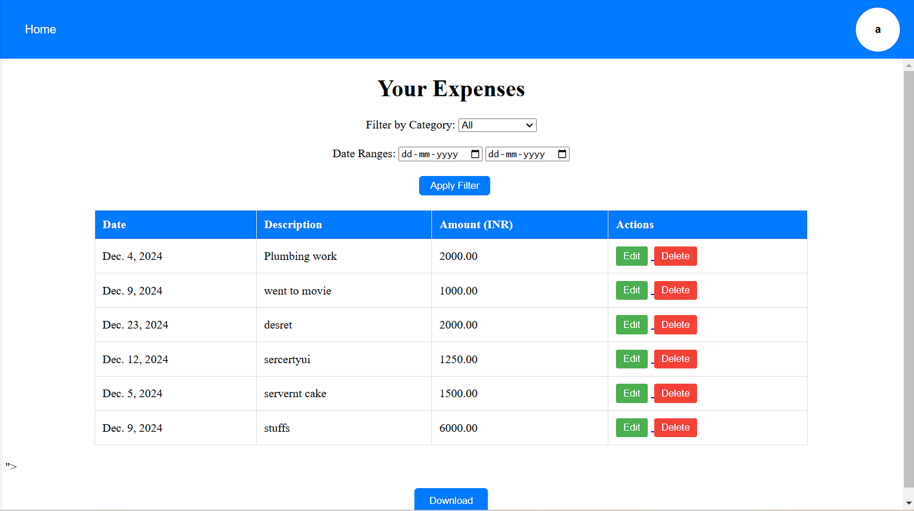

7. **Edit Expense Form**  
   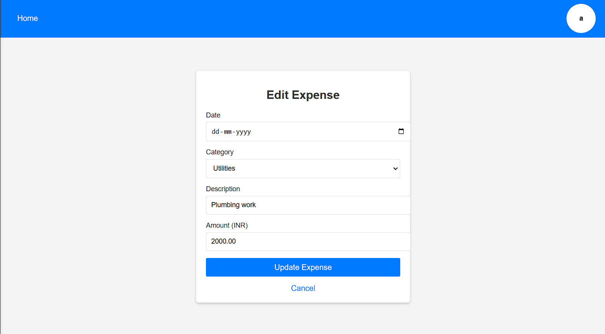

8. **Financial Reports with Visualizations**  
   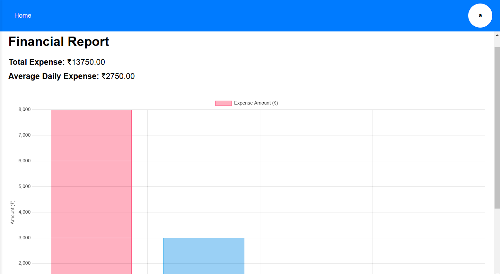

9. **PDF Export Functionality**  
   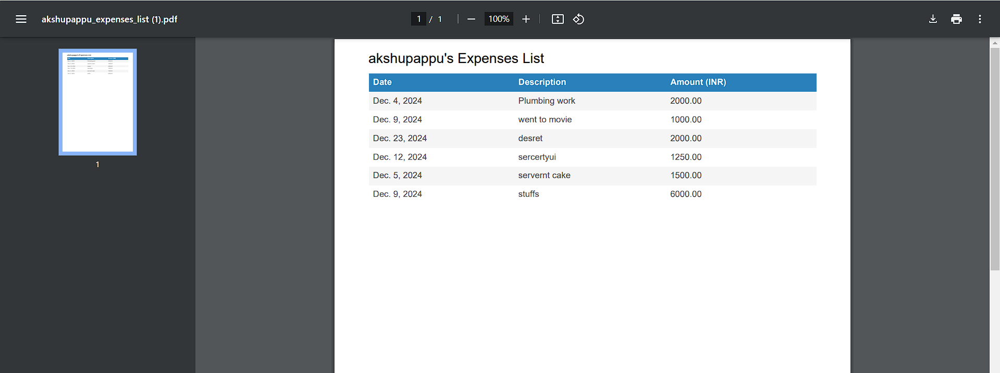

10. **Budget Alerts (Under Budget)**  
    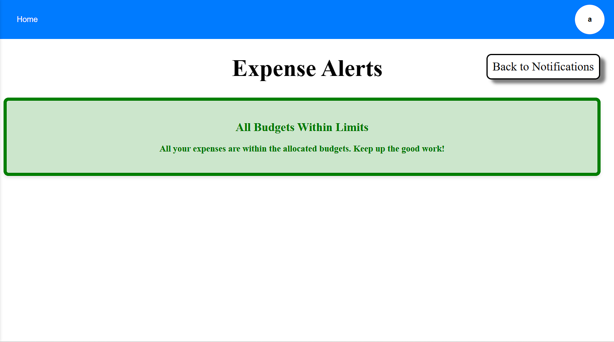

11. **Budget Alerts (Over Budget)**  
    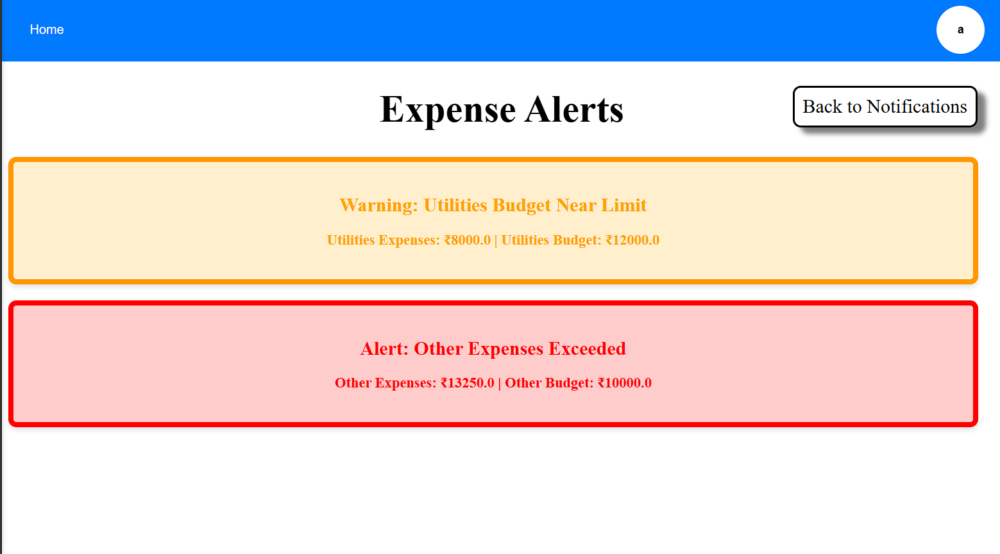

12. **Expense Breakdown Bar Chart**  
    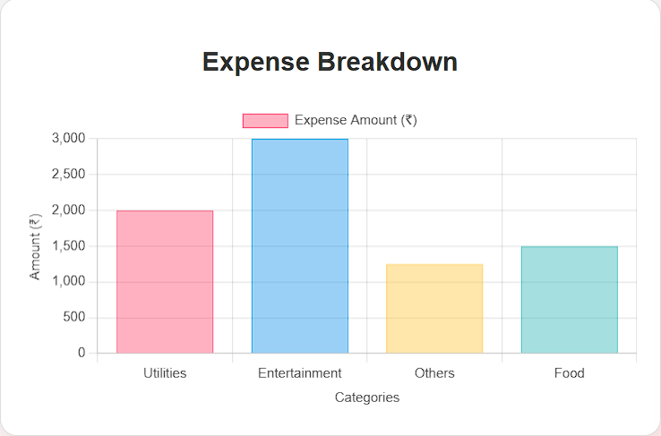

13. **Expense Speedometer (Budget Gauge)**  
    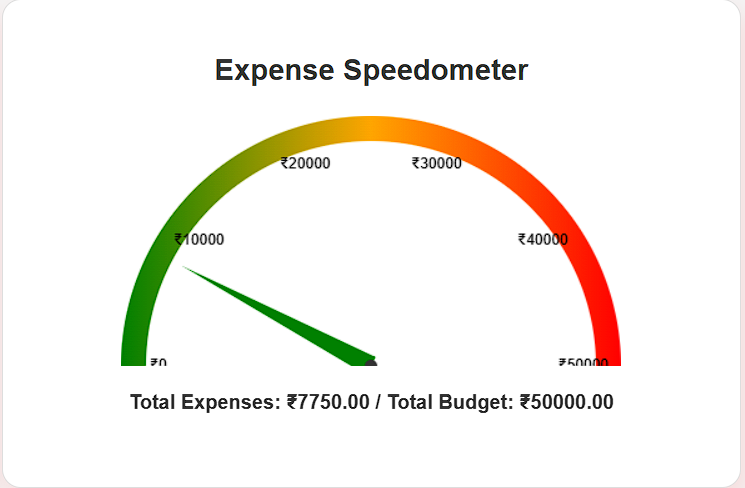

---

## 📜 **License**
This project is licensed under the MIT License. See the `LICENSE` file for more information.

---

### 📂 **Repository Structure**
```plaintext
|-- financial_planner
    |-- accounts
        |-- admin.py
        |-- apps.py
        |-- forms.py
        |-- migrations
        |-- models.py
        |-- signals.py
        |-- templates
            |-- accounts
                |-- add_expenses.html
                |-- alerts.html
                |-- dashboard.html
                |-- edit_expense.html
                |-- edit_profile.html
                |-- financial_reports.html
                |-- home.html
                |-- login.html
                |-- notification.html
                |-- profile.html
                |-- register.html
                |-- view_expenses.html
        |-- tests.py
        |-- urls.py
        |-- views.py
    |-- financial_planner
        |-- asgi.py
        |-- settings.py
        |-- urls.py
        |-- wsgi.py
    |-- manage.py
```

---
