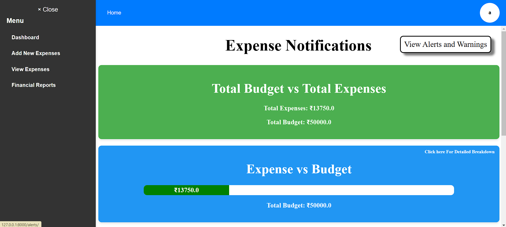

# **Intelligent Financial Planning Hub (Finance Tracker)**

 <!-- Add your banner image -->

## 🌟 **Overview**
The **Intelligent Financial Planning Hub** is a feature-rich web application designed to help users manage their personal finances. Track expenses, set budgets, and generate insightful reports, all within a user-friendly and interactive interface.

### Key Features:
- 🧾 **Expense Management**: Add, edit, and track expenses seamlessly.
- 📊 **Data Visualizations**: Interactive charts for spending analysis.
- 🚨 **Budget Alerts**: Stay on track with real-time notifications.
- 📥 **Report Generation**: Export financial reports as PDFs.
- ⚙️ **User Authentication**: Secure login and registration.

---

## 💻 **Technologies Used**
| **Technology** | **Usage**                  |
|-----------------|---------------------------|
| HTML/CSS        | Frontend Structure        |
| JavaScript      | Interactive Features      |
| Django (Python) | Backend Framework         |
| MySQL           | Database Management       |
| jsPDF           | PDF Generation           |

---

## 🛠️ **Setup and Installation**

### Prerequisites
1. Python 3.x installed on your machine.
2. MySQL server running locally or remotely.
3. Required Python libraries (listed below).

### Steps to Run the Project
1. Clone the repository:
   ```bash
   git clone <repository-url>
   cd <project-folder>
   ```
2. Create and activate a virtual environment:
   ```bash
   python -m venv env
   source env/bin/activate  # On Windows: .\env\Scripts\activate
   ```
3. Install dependencies:
   ```bash
   pip install -r requirements.txt
   ```
4. Configure the database:
   - Create a database (e.g., `finance_tracker`).
   - Update the credentials in `settings.py` under the `DATABASES` section.

5. Apply database migrations:
   ```bash
   python manage.py makemigrations
   python manage.py migrate
   ```
6. Start the development server:
   ```bash
   python manage.py runserver
   ```
7. Access the application:
   Open your browser and navigate to [http://127.0.0.1:8000](http://127.0.0.1:8000).

---

## 📋 **Features**

### 1. **User Authentication**
   - Secure Registration & Login
   - Personalized Dashboard

### 2. **Expense Management**
   - Add, view, edit, and delete expenses.
   - Categorize expenses by type and date.

### 3. **Financial Reports**
   - Generate reports for specific date ranges.
   - Visual insights: pie charts, line graphs.
   - Export reports as PDFs.

### 4. **Dashboard Visualization**
   - Real-time updates with spending summaries.
   - Bar charts and speedometer visualizations.

### 5. **Budget Planning**
   - Set spending limits for categories (e.g., Food, Utilities).
   - Receive alerts for overspending.

---

## 📸 **Screenshots**
### Add screenshots using Markdown:
```markdown


```
### Suggested Sections for Screenshots:
1. **Home Page**
2. **Login/Registration**
3. **Expense Management**
4. **Financial Reports**
5. **Budget Alerts**

---

## 🤝 **Contributing**
1. Fork the repository.
2. Create a branch:
   ```bash
   git checkout -b feature/new-feature
   ```
3. Commit your changes:
   ```bash
   git commit -m "Add new feature"
   ```
4. Push to the branch:
   ```bash
   git push origin feature/new-feature
   ```
5. Open a Pull Request.

---

## 📜 **License**
This project is licensed under the MIT License. See the `LICENSE` file for more information.

---

### 📂 **Repository Structure**
```plaintext
├── finance_tracker/
│   ├── templates/
│   ├── static/
│   ├── app/
│   ├── settings.py
├── README.md
├── requirements.txt
```

---

## 🌟 **Acknowledgments**
Thanks to all contributors and open-source resources that made this project possible.

---

### How to Add This to Your Repository
1. Save this content as `README.md`.
2. Include screenshots in the `screenshots/` folder within your project directory.
3. Use the following commands to update your repository:
   ```bash
   git add README.md screenshots/
   git commit -m "Add a visually appealing README with screenshots"
   git push origin main
   ```

Would you like me to save this as a downloadable `README.md` file for your convenience?